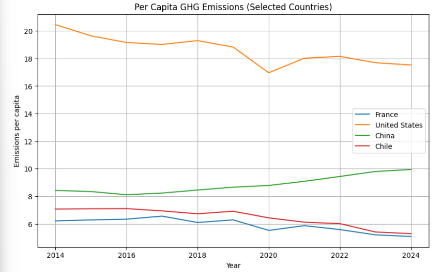

# Greenhouse Gas Emissions Analysis (Python)
# ESG case study on global greenhouse emissions using exploratory data analysis

## 📌 Overview

This project analyzes **per capita greenhouse gas emissions (including land use)** across selected countries between 2000 and 2025.

The goal is to explore emission trends and differences in sustainability pathways using Python for data analysis and visualization.

This project was developed as part of a data and sustainability portfolio focused on ESG and climate-related analytics.

---

## 🎯 Objective

- Compare greenhouse gas emission trends across countries  
- Identify long-term changes in emissions per capita  
- Explore differences between developed and emerging economies  
- Develop ESG-oriented insights using real-world climate data  

---

## 📊 Dataset

- **Source:** Public climate dataset (global emissions data)  
- **Variables:**
  - Entity (Country)
  - Year
  - Per capita greenhouse gas emissions (including land use)
- **Time period:** 2000–2025  

---

## 🛠️ Tools & Technologies

- Python 🐍  
- Pandas (data manipulation)  
- Matplotlib (data visualization)  
- Jupyter Notebook  

---

## 📈 Analysis Performed

- Data loading and cleaning using Pandas  
- Time-series analysis of emissions per country  
- Comparative visualization across selected countries  
- Trend identification over a 25-year period  

---
## Results

---

## 🌍 Key Insights

- Emissions trajectories vary significantly across countries, reflecting structural economic differences
- Developed economies show stabilization or gradual decline in emissions over time
- Emerging economies exhibit increasing trends driven by industrial expansion
- Inclusion of land-use data significantly impacts total emissions accounting and comparability  

---

## 💼 ESG Relevance

This analysis is relevant for:

- ESG reporting and sustainability frameworks  
- Climate risk assessment (insurance / reinsurance sector)  
- Transition risk analysis  
- Environmental policy evaluation  
- Corporate sustainability strategy  

---

## 🚀 Future Improvements

- Add GDP vs emissions correlation analysis  
- Build decoupling index (economic growth vs emissions)  
- Include interactive dashboard (Plotly / Power BI)  
- Extend dataset with energy mix and sectoral emissions  
- Add forecasting models for emission trends  

---

## 👤 Author

Ignacio Torres Olave  
Agricultural Engineer | Student MSc Data & AI for Sustainability · Albert School · Mines Paris–PSL | Looking for an apprenticeship
Based in Paris, France 🇫🇷  

---

## 📌 Note

This project was developed for learning and portfolio purposes, focusing on ESG and climate data analytics using Python.
